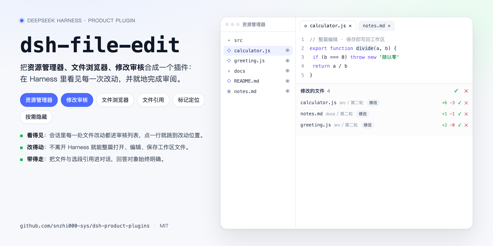
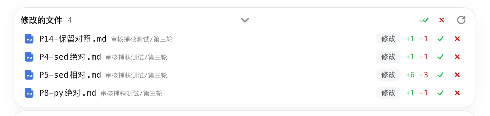
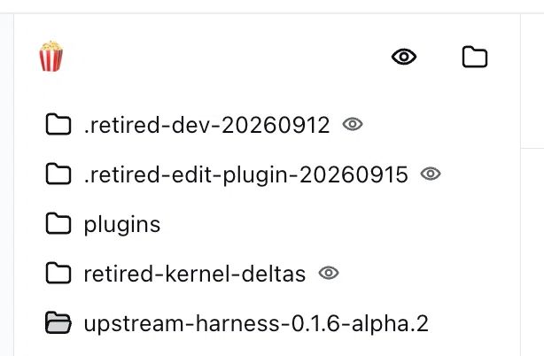
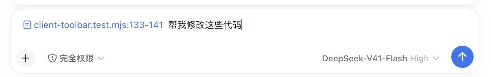
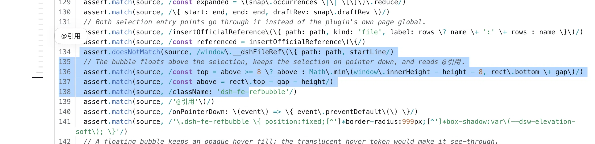
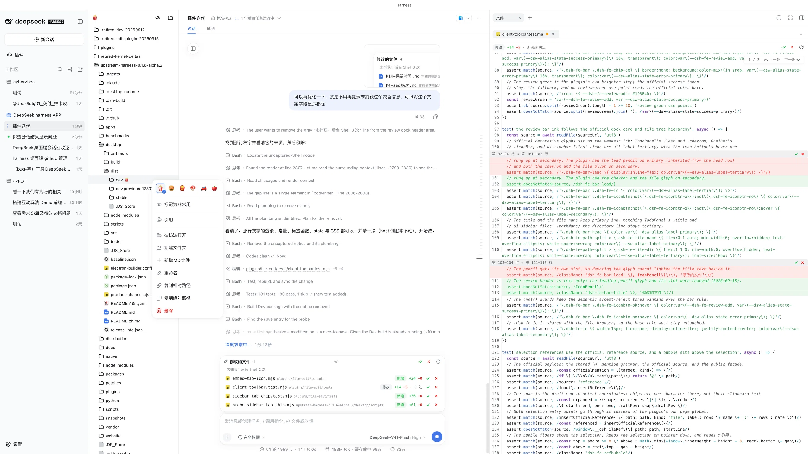
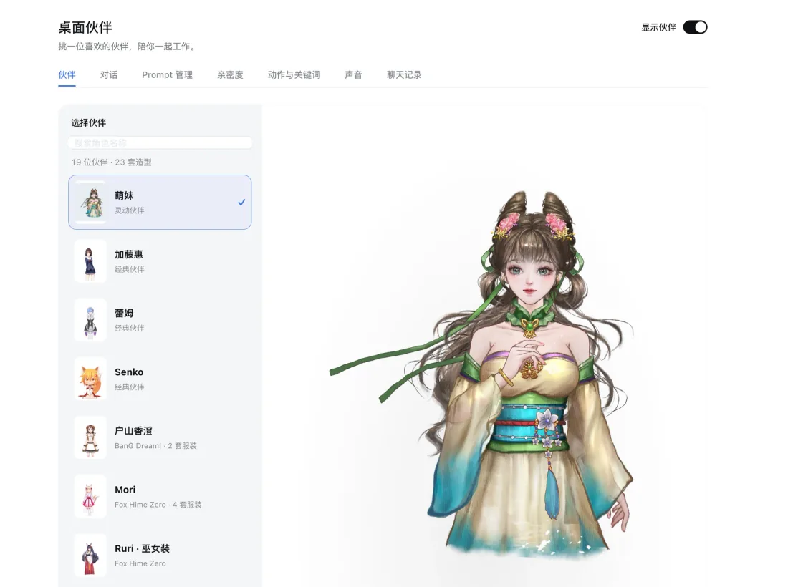

# Harness product plugins

English | [中文](README.zh.md)



Product plugins for DeepSeek Harness. The repository currently ships two plugins: **dsh-file-edit** combines the workspace Explorer, the file browser and agent-change review into one file workspace, so every file change inside Harness is visible and can be settled where it happened; **dsh-desktop-pet** is a companion living in a transparent desktop window, with 23 outfits to choose from, who follows your pointer, moves her mouth while she speaks, and reads text aloud (the flagship character, **Mengmei**, is built on material provided by **苍月动漫**).

## Revision history

| Date | Change | Author | Note | Link |
| --- | --- | --- | --- | --- |
| 2026-09-18 | First release of this page as a product introduction: feature demos, origin and credits, cover; maintenance rules moved to Maintaining and iterating | snzhi000-sys | Version `1.13.44-local` | — |
| 2026-09-21 | Added the desktop-pet plugin introduction: flagship character and asset credit, built-in companion library, pointer lock, speech mouth, text read-out and voice configuration; four new screenshots | snzhi000-sys | Version `dsh-desktop-pet 0.1.1` | — |

---

## Summary

This repository ships two product plugins that can be enabled independently:

| Plugin | One line | What you configure |
| --- | --- | --- |
| **dsh-file-edit** | A file workspace inside the session: change review, Explorer, file browser, file and selection references | Nothing |
| **dsh-desktop-pet** | A desktop companion: built-in character library, pointer lock, speech mouth, **text read-out** | The companion's own Ark endpoint plus model/TTS/ASR keys; read-out also needs a **voice ID** (cloned voices supported) |

### dsh-file-edit: file changes you can see

To make file changes inside a Harness session **visible, editable and referenceable**, the plugin builds one file workspace per session.

**Core capabilities**:

- **Changes stay visible**: every file change in a session enters the review list, grouped by session and workspace, and can be accepted or rejected one by one;
- **Editing stays in place**: files open, edit and save back without leaving Harness, and Markdown renders in place;
- **References stay exact**: files and selections can be referenced into the conversation, so the model always knows what it is answering about;
- **Surfaces stay quiet**: rarely used files hide on demand, and important ones can be marked and located quickly.

---

## Features · dsh-file-edit

### 1. Agent-change review

**Every file change in the session lands in one actionable list**: writes, edits, deletions and moves from the agent all appear under "modified files".



- **Per-row decisions**: accept or reject each change, or settle the whole batch, with one level of undo after a rejection;
- **Line-level comparison**: each row reports added and removed line counts and expands to a line-level diff without leaving the session;
- **Deletion is quarantined**: a deletion moves the content into a persistent quarantine first, and a failed verification refuses the deletion; a rejection restores from quarantine, large files included;
- **Deletion leaves a tombstone**: a file created and then deleted in the same session shows as "created then deleted", instead of vanishing as a net-zero change;
- **Directories aggregate**: a full directory deletion becomes one row that expands to its files and can be accepted or restored as a batch;
- **Ownership is explicit**: subagent changes are attributed along the parent session, while ordinary child sessions keep their own ledger;
- **Uncaptured work is named**: changes the plugin cannot observe, such as writes from a background Shell or an unmanaged compatible shell, are listed by name on an "uncaptured" row that persists with the session;
- **Snapshot-first restore**: after a restart the persisted ledger appears first and the disk is reconciled afterwards.

### 2. Explorer

**A workspace file tree takes over the file entry point**: directories expand per workspace and open for reading or editing in place of the native sidebar.



- **Hide on demand**: files and directories you do not care about hide with one click, leaving the working set in view;
- **Preferences persist**: hiding, expansion and ordering are stored per workspace, so reopening Harness does not mean reorganising;
- **Official visuals**: file and folder glyphs come from the official Harness icon components, matching the kernel's own interface;
- **Labelled tabs**: sidebar tabs carry their own glyph and name, so parallel workspaces never blur together;
- **Boundaries**: dependency and cache directories such as `.git` and `node_modules` are skipped, and the tree stops at 8000 entries or 16 levels.

### 3. File browser

**Reading and editing happen inside the sidebar**: files open in multiple tabs with syntax highlighting and whole-document editing, and saving writes back to the workspace.

- **Multiple tabs**: files open side by side, switch, close and reorder by drag, and tab state survives restarts;
- **Batch closing**: the more menu closes all files or only the settled ones, and a failed review refresh closes nothing;
- **Syntax highlighting** for 24 languages plus Markdown;
- **Whole-document editing**: edits made by the user fold into the baseline instead of disturbing the agent's pending changes;
- **Size boundaries**: files above 512 KB or 8000 lines become read-only large files, and binaries above 4 MB keep only reject and restore;
- **Change targeting**: opening a file from the review list jumps to its first change and highlights it.

### 4. File references

**Files and selections travel into the conversation**: reference a file with `@` in the composer, or select text in a document and reference it directly.





- **References carry a location**: the chip shows the path and the line range, so the model's target is exact;
- **Selection references**: selecting text in a file or review view floats a bubble above the selection, and one click inserts the reference;
- **Two paths, one vocabulary**: the diff view and code browsing use the official `@path` reference with the line range only in the chip label, while the rendered view writes the range into the text and never sends the selected text itself;
- **Consistent with the official behaviour**: both paths declare the official appearance and behave like every other reference in the composer.

### 5. The whole surface



- **Three surfaces, one plugin**: the Explorer, the file browser and change review share the session state, so switching never loses context;
- **The existing layout survives**: with no browsable document the browser tab closes itself, leaving conversation, transcript and the rest of the session untouched.

### 6. Behaviour and boundaries

- **Review baselines**: accepting a whole file makes the current content the new baseline; accepting a hunk settles only that hunk; rejecting a hunk restores it to the baseline, and the remaining diff is recomputed after every partial action;
- **Permission ownership**: sandboxing, approval and permissions belong to the kernel; the plugin only records changes and never vetoes a tool at its entry point;
- **Shell recording**: foreground Shell commands in a writable workspace are captured by a pre-execution snapshot plus recursive watching, and a failed snapshot never blocks the command while the session keeps an explicit partial-coverage conclusion;
- **Unknown pre-modification content**: when `write` overwrites a file and the tool returns no prior content, the row says so and offers accept or manual handling only.

## Features · dsh-desktop-pet (desktop companion)

**A companion living in a transparent desktop window**: the built-in library holds **19 companions and 23 outfits**, and the default, flagship character is **Mengmei**. She follows your pointer, moves her mouth while she speaks, and reads text aloud — **the read-out capability itself comes from this plugin**; the Harness kernel does not read text by itself.

### Built-in companion library



- **19 companions, 23 outfits**: the selector lives in the sidebar's 桌宠 panel, searches by name, and switches and saves on a single click;
- **The flagship character, Mengmei**: selected by default and listed first, she is the face of this product; her **material is provided by 苍月动漫** and we built the Live2D / DragonBones drive, pointer following, mouth and speech chain on top of it (the material remains its owner's; see Origin and credits);
- **One companion, several outfits**: different costumes of the same character collapse into one entry (Mori's four, Toyama Kasumi's two) and switch inside the character's own detail;
- **Each character drives itself**: Live2D (Cubism 3/4) and DragonBones companions each use their own animation and interaction profile without affecting the others.

### Pointer lock: gaze and body follow together


- **The eyes lock onto the pointer**: an eye offset of 18 keeps the gaze on the cursor;
- **The body follows too**: an additive offset on the official runtime's `zhuan` bone moves the body inside an ellipse of radius 350 horizontally and 300 vertically in skeleton units, with sensitivity 2 and 0.18 s smoothing, so it follows without twitching;
- **It keeps working outside the window**: native pointer events still reach the pet while the cursor is elsewhere on screen;
- **It recentres when it should**: dragging the character, previewing an action, speaking, or focusing the compact input below the character returns her to neutral; turning animation off resets and holds still.

### The mouth moves while she speaks


- **Mouth shapes driven by the timeline**: Live2D companions drive `ParamMouthOpenY` / `PARAM_MOUTH_OPEN_Y`, while DragonBones companions use hand-made a/o/i/m shapes;
- **Reading rules come first**: Arabic digits read as spoken numerals, Latin letters by letter name, common symbols by their reading (`%` → percent, `@` → at), while typographic punctuation is only a pause and closes the mouth;
- **Untrustworthy word timings are replaced**: the speech service returns a flat 30 ms span for tokens containing digits or symbols, so the timeline is reflowed against the audio's own voiced segments and the mouth closes only where the audio really pauses;
- **Approximate mouth shapes**, with no claim of phoneme-level alignment.

### Reading text aloud

**Speaking text is provided by this plugin**, through three entry points:

- **A read-out button under every reply** in the official assistant action strip, beside copy and share; pressing it again while it plays stops all reading;
- **Read a selection aloud**: selecting text in the conversation panel floats a 朗读 pill above it, and the file browser — which already floats its own reference bubble — receives the same action inside that bubble;
- **Broadcast the main conversation** (a switch on the partner page): reads the part of the main agent's prose addressed to you;
- **Only words a person would say**: reasoning, tool calls, fenced code, tables and markdown decoration are never read, and a read-out never writes into the pet's bubble — **the bubble only shows the companion's own reply**.

### The voice and its key are yours to configure

The pet keeps its own speech configuration (settings → 对话 / 声音) and **does not inherit Harness model settings**:

- **Endpoint and keys**: fill in the Ark endpoint and model, then the model / TTS / ASR keys separately;
- **Reading voice**: read-out needs a **TTS key and a voice ID**; we use the **Doubao voice** (Volcengine Ark) speech synthesis API;
- **Cloned voices supported**: a speaker ID starting with `S_` is synthesised as a clone, and cloned voices take the same read-out path as the official ones;
- **Missing pieces are named**: without a TTS key, without a voice, or without the pet on screen, the control states the reason instead of failing silently;
- **Read-out is optional**: the character library, pointer following and text chat all work without TTS.

### Behaviour and boundaries

- **The companion has its own conversation**: open the input from the right-click menu, or use settings → 聊天记录; both share the latest conversation and a bounded context, and one reply keeps the configuration it started with;
- **The bubble belongs to the character**: neither the main conversation's prose nor a read-out is written into it;
- **Model assets are not committed here**: `.gitignore` excludes `desktop-pet/assets/*` and only `NOTICE.txt` is tracked (the 781 model files live on disk, not in git), so a fresh clone has the code but no models and restores them by the steps in [MAINTAINING.md](MAINTAINING.md); those assets **do ship with the plugin package and the product profile**, and redistributing them needs each owner's permission;
- **Asset rights stay with their owners**: character artwork, models and the Live2D Core are not covered by this repository and need their own permission before public redistribution.

---

## Origin and credits

### File workspace (dsh-file-edit)

**dsh-file-edit is a derivative of the original `dsh-file-edit` plugin**, reworked with extensive optimisation and many added features. Thanks to the original author for the foundation.

- Original project: [justarook1e/dsh-file-edit](https://github.com/justarook1e/dsh-file-edit), released under MIT with copyright held by `justarook1e`; that repository is no longer maintained and has moved to [justarook1e/dsh-ide-lite](https://github.com/justarook1e/dsh-ide-lite).
- **Inherited**: workspace file browsing and editing, accept/reject of agent changes, rejection undo, deletion quarantine, and the runtime state-directory and route conventions.
- **Added or reworked here**: review listing attributed by session and workspace, subagent change attribution, directory deletion batches, named disclosure of uncaptured changes, deletion tombstones, official glyphs and labelled tabs, on-demand hiding with persisted preferences, line-level references from the rendered view, change targeting with line-accurate highlight, and the review bar's width and ink aligned with the official composer card.
- **License obligation**: as MIT requires, [LICENSE](LICENSE) keeps the original author's copyright notice; embedded third-party components are listed in [THIRD-PARTY-NOTICES.md](THIRD-PARTY-NOTICES.md).

### Desktop companion (dsh-desktop-pet)

**The companion is our own product plugin, maintained in this repository**, and the product profile assembles it into the runtime.

- **The flagship character Mengmei is built on material provided by 苍月动漫**: we use that material and built the Live2D / DragonBones drive, pointer following, mouth, speech and read-out chain on top of it; the character and its model remain entirely their owner's.
- **The built-in Live2D models** come from the third-party collection [Eikanya/Live2d-model](https://github.com/Eikanya/Live2d-model); provenance and boundaries are recorded in `desktop-pet/assets/NOTICE.txt`, and **the model files are not committed here** (only `NOTICE.txt` is tracked) while the plugin package and the product profile do ship them, so redistributing them needs the owners' permission.
- **Speech** uses the **Doubao voice** (Volcengine Ark) synthesis API, so every user brings their own key and voice; cloned voices are used through the same Ark speaker ID.
- **Mouth, following and read-out rules** rest on this plugin's own implementation and measurements, documented in [desktop-pet/README.md](desktop-pet/README.md) ([中文](desktop-pet/README.zh.md)).

---

## Install and enable

Both plugins are assembled by the Harness product profile and ship with the runtime: **installing Harness installs the plugins**, and no separate install script exists.

- **Product manifest**: the app tree's `distribution/profile-manifest.json` points `dsh-file-edit` and `dsh-desktop-pet` at `plugins/file-edit` and `plugins/desktop-pet`;
- **Session assembly**: the app tree's `distribution/cordis.patch.yml` inserts both plugin entries;
- **Sync**: the app tree takes the plugin sources from this repository with `npm run sync:plugins`, which the packaging chain runs automatically;
- **The companion works out of the box**: the character library, switching characters, touch and drag interaction and pointer following need no configuration at all. Its window starts hidden — turn on 显示伙伴 in the sidebar's 桌宠 panel, and that choice is remembered;
- **Only the speech chain needs credentials of your own**: talking to the companion needs its own model endpoint and key, and reading text aloud additionally needs a TTS key and a voice ID (Doubao / Volcengine Ark, cloned voices included); the mouth, the captions and the action keywords are all driven by that speech chain. These are account credentials for the feature, not installation steps — see *The voice and its key are yours to configure* above.

## Repository layout

```
file-edit/              file-workspace plugin: sources and its own README pair
desktop-pet/            desktop-companion plugin: sources, build output and its README pair (Live2D models are not committed)
docs/                   cover source and feature screenshots for both plugins
scripts/                generator and verifier for the third-party notices
MAINTAINING.md / .zh.md maintenance rules: layout, build, sync, release flow, naming contracts
LICENSE                 license
THIRD-PARTY-NOTICES.md  embedded third-party components and the derivative-work note
```

## Maintaining and iterating

Plugin sources are maintained only in this repository; the app-tree copy is generated by the sync. Directory conventions, build and test commands, the sync and packaging flow, the persisted naming contracts and the steps for adding a plugin live in **[MAINTAINING.md](MAINTAINING.md)**.

## License

Released under the **MIT License** — see [LICENSE](LICENSE). You may use, modify and redistribute these plugins, including inside another product, as long as the copyright notice and the permission notice stay with the code. Embedded third-party components: [THIRD-PARTY-NOTICES.md](THIRD-PARTY-NOTICES.md). **MIT covers the code only**: the characters and Live2D models under `desktop-pet/assets/` are covered by their own notices and stay outside this repository's licence (they are **not committed here**, but the plugin package and the product profile do ship them; see [MAINTAINING.md](MAINTAINING.md)).
