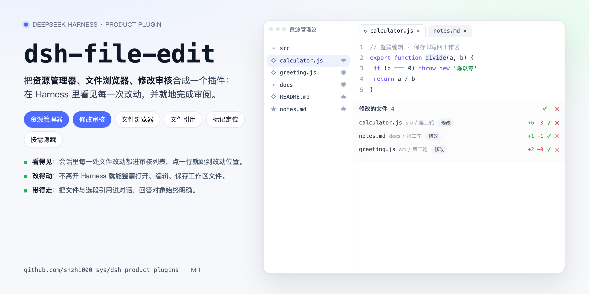
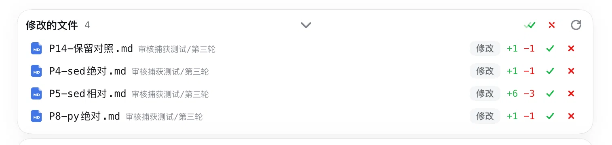
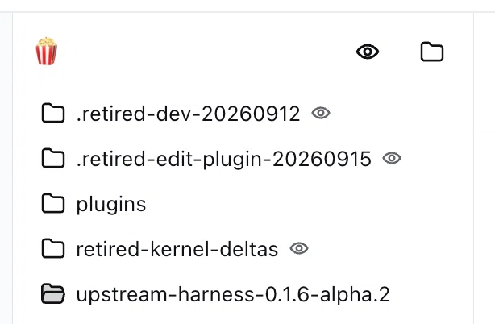
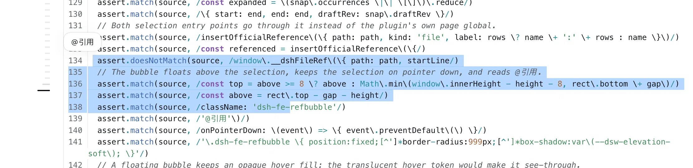
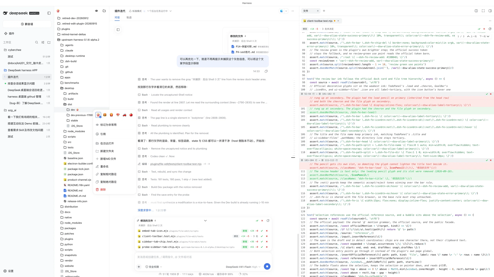

# dsh-file-edit

[English](README.md) | 中文



把资源管理器、文件浏览器与修改审核合成一个插件：在 DeepSeek Harness 里看见每一次文件改动，并就地完成审阅。

## 修订记录

| 时间 | 修订内容 | 修订人 | 备注 | 飞书链接 |
| --- | --- | --- | --- | --- |
| 2026-09-18 | 首发：改为产品口径，补齐能力说明、功能演示、来源与致谢 | snzhi000-sys | 对应版本 `1.13.44-local` | — |

---

## 概述

为让 Harness 会话里的文件改动**看得见、改得动、带得走**，本插件在会话内建立统一的文件工作面，把资源管理器、文件浏览器与修改审核收进一个插件。

**核心能力**：

- **改动可见**：会话内每一处文件改动进入审核列表，按会话与工作区归属，逐条可接受或拒绝；
- **就地可改**：不离开 Harness 即可打开、编辑并写回工作区文件，Markdown 直接看渲染结果；
- **引用明确**：文件与选段可以引用进对话，模型回答的对象始终清晰；
- **按需收敛**：非常用文件按需隐藏，重要文件可标记并快速定位。

---

## 功能详情

### 一、修改审核

**把会话里的文件改动收进一张可操作的列表**：AI 的每一次写入、编辑、删除与移动都进入「修改的文件」，一眼看清本轮动了什么。



- **逐条处置**：每条改动可单独接受或拒绝，顶部支持整批接受与整批拒绝，拒绝后可撤销一层；
- **行级对照**：列表给出新增与删除行数，展开即见行级差异，不必离开会话；
- **删除有隔离**：删除前完整转入持久隔离区，校验失败则禁止删除；拒绝时从隔离区恢复，大文件同样可恢复；
- **删除有墓碑**：同一会话内新建后又被删除的文件显示为「本会话新建后删除」，不会按净零变化凭空消失；
- **目录聚合成行**：完整目录删除在列表里聚合为一行，可展开查看目录内文件，也可整批接受或整批恢复；
- **归属清晰**：子代理产生的改动沿父会话归属，消息编辑派生出的普通子会话保持独立账本；
- **未捕获显式标注**：无法观察到的改动，例如后台 Shell 与未托管兼容 Shell 的写入，会在审核栏的「未捕获」一行具名标出并随会话持久化，而不是静默略过；
- **快照优先恢复**：重启后先显示持久化待审账本，再校准待审目标的磁盘状态，首屏不等全工作区扫描。

### 二、资源管理器

**用工作区文件树接管文件入口**：按工作区展开目录结构，点开即浏览或编辑，替代原生文件侧栏。



- **按需隐藏**：不关心的文件与目录一键隐藏，视图只留常用内容；
- **状态留存**：隐藏、展开与排序偏好按工作区保存，重开 Harness 不必重新整理；
- **官方视觉**：文件与文件夹图标沿用 Harness 官方图标组件，与内核界面观感一致；
- **标签成对**：侧栏标签页自带图标与名称，多个工作区同时打开时不混淆；
- **手动与自动刷新**：目录可手动刷新，文件集合变化时自动刷新；
- **边界**：跳过 `.git`、`node_modules` 等依赖与缓存目录，树最多 8000 条目、16 层。

### 三、文件浏览器

**在侧栏内完成整篇阅读与编辑**：多标签打开文件，支持语法高亮与整篇编辑，保存即写回工作区。

- **多标签**：文件以标签页并列打开，可切换、可关闭、可拖拽排序，标签状态跨会话保持；
- **批量关闭**：更多菜单提供关闭全部与关闭已处理文件，后者只关已保存且无待审内容的标签，审核刷新失败时不关闭任何文件；
- **语法高亮**：覆盖 24 种语言与 Markdown；
- **整篇编辑**：编辑器内直接修改并保存，用户编辑折入基线，不打扰 agent 的待审改动；
- **大小边界**：超过 512 KB 或 8000 行的文件标为只读大文件，二进制超过 4 MB 时只保留拒绝与还原能力；
- **改动定位**：从审核列表点开文件时直接定位到第一处改动并高亮提示，不再从文件顶部找起。

### 四、文件引用

**把文件与选段带进对话**：在输入框以 `@` 引用文件，或在文档里选中文字后直接引用。




- **引用即带位置**：引用芯片显示文件路径与行号范围，模型收到的对象明确到行；
- **选段引用**：在文件或审核视图里选中文字，气泡浮现在选区上方，点击即插入引用；
- **两条通路分工**：差异视图与代码浏览走官方 `@path` 引用，行区间只显示在芯片上；渲染视图的引用把行范围写进文本，让模型知道引用的是哪几行，而选中行的正文并不发送；
- **与官方一致**：两条通路都声明官方外观，因此都绘制官方文件图标，并与输入框内其它引用行为统一。

### 五、整体界面



- **一个插件三块面**：资源管理器、文件浏览器与修改审核共享同一份会话状态，切换不丢上下文；
- **不抢占原有流程**：没有可浏览文档时浏览器标签自行关闭，会话、对话与轨迹保持原生布局。

### 六、行为与边界

**审核与编辑的边界都在会话内说清，不假装完整**。

- **审核基准**：整文件接受即当前内容成为新基线；局部接受只结算该片段；局部拒绝把该片段恢复为基线，每次局部操作后重新计算剩余差异，因此已审内容不会重复出现；
- **权限归属**：沙箱、审批与权限归内核，本插件只记录变更，不在工具入口否决执行；用户在文件视图里的保存仍限制在当前工作区并保留版本校验；
- **Shell 记录**：可写工作区的前台 Shell 按执行前快照加递归监听捕获，快照失败不阻止命令执行，会话持久保留部分捕获的结论；
- **修改前内容未知**：`write` 覆盖文件而工具未返回修改前内容时，该行显示「修改前内容未知」，只允许接受或手动处理，不提供可能破坏数据的自动拒绝。

---

## 来源与致谢

**本插件基于原插件 `dsh-file-edit` 二次开发**，在原版基础上做了大量优化与功能补充，感谢原作者提供的基础能力。

- 原版项目：[justarook1e/dsh-file-edit](https://github.com/justarook1e/dsh-file-edit)，以 MIT 发布，版权归原作者 `justarook1e` 所有；该仓库已停止维护并迁移为 [justarook1e/dsh-ide-lite](https://github.com/justarook1e/dsh-ide-lite)。
- **沿用**：工作区文件浏览与编辑、变更审查的接受与拒绝、拒绝撤销、删除隔离、运行期状态目录与路由约定。
- **本版优化与新增**：按会话与工作区归属的审核列表、子代理改动归属、目录删除批次聚合、未捕获改动的具名披露、删除墓碑、官方图标与标签成对、按需隐藏与偏好留存、渲染视图的行级引用、行号贯通的改动定位与高亮、审核栏与官方卡片对齐的宽度与墨色。
- **许可证要求**：按 MIT 的要求，本仓库的 [LICENSE](../LICENSE) 同时保留原作者版权声明；内嵌第三方组件见 [THIRD-PARTY-NOTICES.md](../THIRD-PARTY-NOTICES.md)。

---

## 装配与启用

本插件由产品 Profile 装配，随发行包进入运行时，不需要单独的安装或更新脚本。

- **产品清单**：`distribution/profile-manifest.json` 的 `productPlugins` 把 `dsh-file-edit` 指向本目录；
- **会话装配**：`distribution/cordis.patch.yml` 插入 `dsh-file-edit` 条目；
- **入口**：宿主入口 `host/index.mjs`，浏览器加载 `client/dist/client.js`。

## 仓库结构

```
file-edit/
  package.json          插件清单，声明宿主入口、客户端入口与注入面
  host/                 宿主实现：会话账本、基线、差异、接受与拒绝、删除隔离
  client/src/           客户端源码：资源管理器、文件浏览器、审核列表、引用
  client/dist/          构建后的客户端产物，随插件一起分发
  tests/                宿主与客户端行为测试
  scripts/              构建辅助脚本
docs/
  cover.html            封面源文件
  images/               封面与功能演示图
```

## 运行期数据

- **审阅状态**：每会话的已结算基线、磁盘快照、删除批次与撤销记录保存在 Harness 运行期状态目录 `dsh-file-edit-state` 下，重启自动恢复；插件之外删除该目录只影响审阅历史，不动工作区文件；
- **删除隔离区**：被删除内容与批次清单保存在该目录下的隔离区内，供接受或恢复使用；
- **资源管理器偏好**：隐藏、展开与排序偏好保存在 `dsh-explorer-state` 下。

## 已知限制

- 替换了原生工作区浏览器，因此没有搜索、分组与重命名等对话框，保留了添加工作区与新建会话；
- 依赖与缓存目录不进入文件树，树有条目与层数上限；
- 后台 Shell 与持久终端的写入不被捕获，只在审核栏具名披露，不伪造记录；
- Markdown 渲染视图的行级引用依赖渲染器标注的行号，跨行行内代码会造成块内行号漂移，下一个块级标签会重新定位。

## 许可证

本仓库以 **MIT License** 发布，见 [LICENSE](../LICENSE)。在保留版权声明与许可声明的前提下，可以使用、修改、再分发本插件，包括打包进其它产品。内嵌第三方组件见 [THIRD-PARTY-NOTICES.md](../THIRD-PARTY-NOTICES.md)；生成与校验用 `node scripts/collect-third-party-notices.mjs` 与 `--check`。
